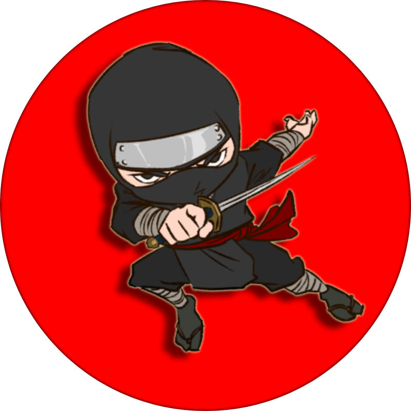

# ineuron-assign-01

---
## Assignment One 
* In this project I have tried playing around with abit of HTML and CSS.

* Getting dirty with different concepts of design and trying to find the logic to come up with the best pattern to design UI.

---

### Skills Learned --->👇

1. HTML
2. CSS

---

### About Me 😜

Hey! I'm my on way to create a good Sculpture out of me. Therefore, I am ready to burn with Good discipline and consistency. 

Wish me Good Luck for my Journey 🛣️

